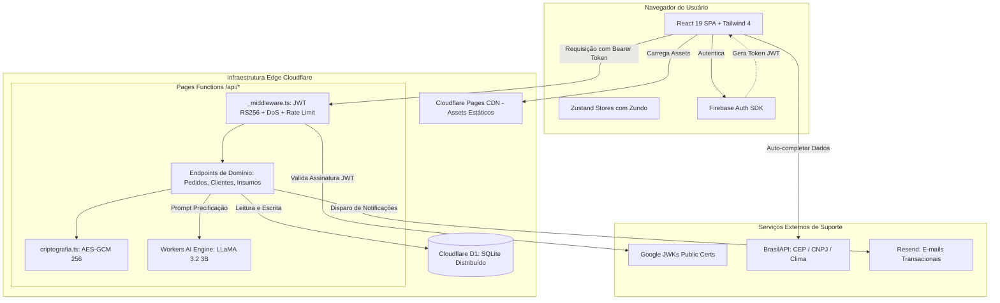
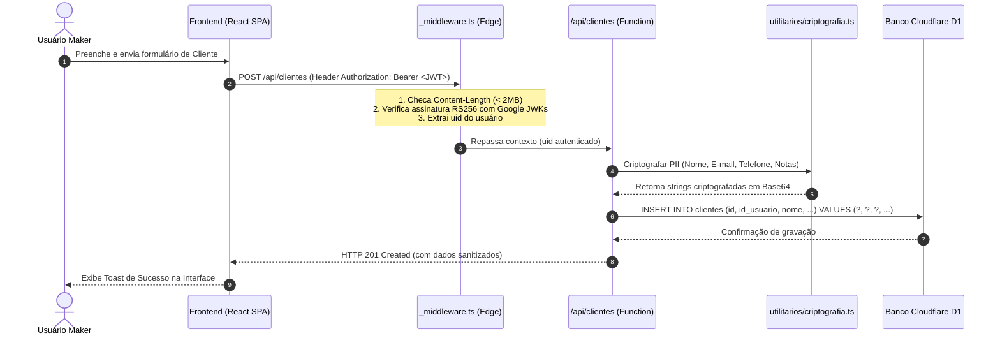
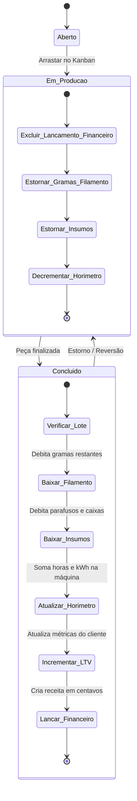

# 🖨️ Documentação Oficial e Completa do Sistema PrintLog

> **Versão:** 3.0.0  
> **Sistema:** PrintLog — Plataforma Integrada de Gestão de Manufatura Aditiva (Impressão 3D)  
> **Formato:** Documento Único Consolidado (.md)  
> **Data de Atualização:** 2026-09-20  

---

## 📑 Sumário Geral

1. [Parte 1: Visão Geral e Introdução (README Executivo)](#1-visão-geral-e-introdução-readme-executivo)
   - 1.1 [Objetivo do Sistema e Problema que Resolve](#11-objetivo-do-sistema-e-problema-que-resolve)
   - 1.2 [Modelo de Negócio e Proposta de Valor](#12-modelo-de-negócio-e-proposta-de-valor)
   - 1.3 [Instruções Rápidas: Como Rodar do Zero (Quickstart)](#13-instruções-rápidas-como-rodar-do-zero-quickstart)
2. [Parte 2: Documentação Técnica e de Arquitetura](#2-parte-2-documentação-técnica-e-de-arquitetura)
   - 2.1 [Stack Tecnológica Detalhada com Versões](#21-stack-tecnológica-detalhada-com-versões)
   - 2.2 [Padrão Arquitetural: SPA Híbrida + Edge Serverless Isolates](#22-padrão-arquitetural-spa-híbrida--edge-serverless-isolates)
   - 2.3 [Diagramas de Arquitetura e Fluxo de Dados](#23-diagramas-de-arquitetura-e-fluxo-de-dados)
   - 2.4 [Configuração de Ambiente e Variáveis (.env)](#24-configuração-de-ambiente-e-variáveis-env)
   - 2.5 [Segurança, Criptografia AES-GCM e Conformidade LGPD](#25-segurança-criptografia-aes-gcm-e-conformidade-lgpd)
   - 2.6 [Modelo de Dados Relacional (Cloudflare D1 / SQLite)](#26-modelo-de-dados-relacional-cloudflare-d1--sqlite)
   - 2.7 [Especificação Completa das APIs e Integrações (Catálogo OpenAPI/REST)](#27-especificação-completa-das-apis-e-integrações-catálogo-openapirest)
3. [Parte 3: Requisitos e Regras de Negócio](#3-parte-3-requisitos-e-regras-de-negócio)
   - 3.1 [Requisitos Funcionais (RF)](#31-requisitos-funcionais-rf)
   - 3.2 [Requisitos Não-Funcionais (RNF)](#32-requisitos-não-funcionais-rnf)
   - 3.3 [Regras de Negócio Detalhadas (RN)](#33-regras-de-negócio-detalhadas-rn)
   - 3.4 [Motor Matemático de Precificação (Fórmulas Oficiais)](#34-motor-matemático-de-precificação-fórmulas-oficiais)
   - 3.5 [Workflow de Conclusão e Estorno Atômico Tríplice](#35-workflow-de-conclusão-e-estorno-atômico-tríplice)
4. [Parte 4: Manual do Usuário Final](#4-parte-4-manual-do-usuário-final)
   - 4.1 [Guia Passo a Passo das Principais Operações](#41-guia-passo-a-passo-das-principais-operações)
     - 4.1.1 [Configuração Inicial do Estúdio e Custos Operacionais](#411-configuração-inicial-do-estúdio-e-custos-operacionais)
     - 4.1.2 [Cadastro de Máquinas e Peças de Desgaste](#412-cadastro-de-máquinas-e-peças-de-desgaste)
     - 4.1.3 [Gestão de Bobinas de Filamento e Insumos Secundários](#413-gestão-de-bobinas-de-filamento-e-insumos-secundários)
     - 4.1.4 [Como Precificar uma Peça e Usar a Sugestão por IA](#414-como-precificar-uma-peça-e-usar-a-sugestão-por-ia)
     - 4.1.5 [Compartilhar Orçamento Público e Acompanhar Aprovação](#415-compartilhar-orçamento-público-e-acompanhar-aprovação)
     - 4.1.6 [Operação do Kanban de Produção e Rastreio para o Cliente](#416-operação-do-kanban-de-produção-e-rastreio-para-o-cliente)
     - 4.1.7 [Finalizar Pedido com Baixa Automática e Lançamento no Caixa](#417-finalizar-pedido-com-baixa-automática-e-lançamento-no-caixa)
     - 4.1.8 [Registrar Manutenção Preventiva e Controlar Horímetro](#418-registrar-manutenção-preventiva-e-controlar-horímetro)
     - 4.1.9 [Apuração de Desperdício, Sucata e Falhas](#419-apuração-de-desperdício-sucata-e-falhas)
     - 4.1.10 [Gestão de Clientes (CRM) e Consulta CNPJ Automática](#4110-gestão-de-clientes-crm-e-consulta-cnpj-automática)
     - 4.1.11 [Exportação e Exclusão Total de Dados (LGPD)](#4111-exportação-e-exclusão-total-de-dados-lgpd)
   - 4.2 [Perguntas Frequentes (FAQ) e Diagnóstico de Falhas Comuns](#42-perguntas-frequentes-faq-e-diagnóstico-de-falhas-comuns)

---

# 1. Visão Geral e Introdução (README Executivo)

### 1.1 Objetivo do Sistema e Problema que Resolve

A manufatura aditiva (impressão 3D FDM e SLA/Resina) evoluiu de um hobby caseiro para um ecossistema profissional composto por birôs de engenharia, designers de produto, fazendas de impressão (*print farms*) e criadores (*makers*). No entanto, a gestão desses negócios é tradicionalmente caótica, dependendo de planilhas desconexas, cálculos manuais imprecisos e anotações informais em aplicativos de mensagens.

#### O Problema Real do Maker:
1. **Prejuízos Invisíveis na Precificação:** A maioria dos makers calcula apenas o filamento (ex: $R\$\ 0,10$ por grama), ignorando consumo em Watts sob bandeiras tarifárias, depreciação por hora de bicos e correias, insumos de montagem (parafusos, ímãs, inserts de latão, caixas de papelão), tempo de modelagem CAD e taxas abusivas de marketplaces (Shopee, Mercado Livre).
2. **Descontrole de Estoque Físico:** Carretéis são dados como disponíveis quando já não possuem gramas suficientes para completar uma peça de 20 horas, resultando em paradas noturnas, perdas de trabalho e desperdício de material.
3. **Falta de Manutenção Preditiva:** Bicos de latão desgastam e correias afrouxam sem registro de horímetro, causando perda de passo, acabamentos dimensionais rejeitados e entupimentos (*clogs*).
4. **Desconexão entre Produção e Financeiro:** Quando uma peça fica pronta, o operador precisa lembrar de atualizar planilhas de fluxo de caixa, calcular o lucro real e deduzir o estoque manualmente.
5. **Comunicação Amadora com o Cliente:** Falta de links formais de orçamento interativo e rastreamento visual transparente do status de impressão.

#### A Solução PrintLog:
O **PrintLog** é uma plataforma SaaS *All-in-One* concebida para integrar e automatizar todo o ciclo produtivo da manufatura aditiva:
- **Do orçamento à entrega:** Precificação matemática milimétrica com motor assistido por IA rodando na borda (LLaMA 3.2 3B).
- **Esteira Kanban de Produção:** Gestão visual com transições atômicas que debitam filamentos e insumos, atualizam o horímetro digital da impressora e geram receitas no caixa em tempo real.
- **Rastreabilidade e Confiança:** Encurtador de URLs para propostas públicas aprováveis pelo cliente e rastreador de progresso da peça estilo e-commerce.
- **Blindagem e Conformidade Total (LGPD):** Criptografia de ponta a ponta (AES-GCM) para todos os dados de clientes (PII) e portal do titular com exportação e direito ao esquecimento irreversível.

### 1.2 Modelo de Negócio e Proposta de Valor

- **Modelo de Cobrança:** Software as a Service (SaaS) Freemium com planos `FREE`, `PRO` e `FUNDADOR`.
- **Segmentação:**
  - *Makers Autônomos (Plano Free/Pro):* Foco em precificação exata, propostas rápidas para WhatsApp e controle de 1 a 5 impressoras.
  - *Print Farms e Birôs (Plano Pro/Fundador):* Foco em horímetro de dezenas de máquinas, manutenção preditiva, estoque de insumos secundários, CRM corporativo (B2B com auto-preenchimento de CNPJ via BrasilAPI) e multi-estúdios (*multi-tenant*).

### 1.3 Instruções Rápidas: Como Rodar do Zero (Quickstart)

Siga os passos abaixo para clonar, configurar e executar a aplicação completa em ambiente de desenvolvimento:

#### Pré-Requisitos:
- **Node.js:** Versão 20 LTS ou superior.
- **npm:** Versão 10 ou superior.
- **Git:** Instalado na máquina.

#### Passo 1: Clonar o Repositório
```bash
git clone https://github.com/madebycotrim/printlog.git
cd printlog
```

#### Passo 2: Instalar as Dependências
```bash
npm install
```

#### Passo 3: Configurar Variáveis de Ambiente
Copie o arquivo de exemplo e configure suas credenciais locais:
```bash
cp .env.example .env
```
> *Nota: Para desenvolvimento básico, as variáveis do Firebase Authentication e do e-mail administrativo podem ser mantidas conforme o template ou apontadas para seu projeto Firebase.*

#### Passo 4: Executar o Ambiente Completo (Frontend + Edge + Banco Local D1)
Recomendamos o comando `dev:full` que inicia simultaneamente o servidor Vite e o emulador local Cloudflare Wrangler com banco de dados SQLite D1:
```bash
npm run dev:full
```
A aplicação estará disponível em `http://localhost:5173`.

#### Comandos Disponíveis no `package.json`:
| Comando | Ação |
|---|---|
| `npm run dev` | Inicia o frontend Vite em modo standalone (porta 5173). |
| `npm run dev:full` | Inicia o Frontend + Cloudflare Pages Functions + Banco D1 Local. |
| `npm run build` | Compila o bundle otimizado de produção na pasta `dist/`. |
| `npm run lint` | Executa o ESLint para validação estática de código TypeScript/React. |
| `npm run audit:seguranca` | Executa a verificação de vulnerabilidades de dependências (`npm audit`). |
| `npm run deploy` | Limpa o build, compila e publica no Cloudflare Pages via Wrangler. |

---

# 2. Parte 2: Documentação Técnica e de Arquitetura

### 2.1 Stack Tecnológica Detalhada com Versões

| Camada | Tecnologia | Versão | Propósito / Responsabilidade |
|---|---|---|---|
| **Linguagem** | TypeScript | `^5.9.3` | Tipagem estática rigorosa de ponta a ponta (front e edge). |
| **Framework UI** | React | `^19.2.0` | Renderização baseada em componentes, hooks modernos e transições. |
| **Build Tool** | Vite | `^7.2.4` | Empacotamento ultra-rápido, Hot Module Replacement (HMR). |
| **Estilização** | TailwindCSS | `^4.1.18` | Framework CSS utilitário com suporte nativo a temas e modo escuro. |
| **Estado Global** | Zustand + Zundo | `^5.0.11` / `^2.3.0` | Gerenciamento de estado descentralizado por módulo com undo/redo. |
| **Validação** | Zod | `^4.3.6` | Schemas de validação de dados em runtime (formulários e APIs). |
| **Formulários** | React Hook Form | `^7.71.2` | Controle de performance de inputs e integração com resolvers Zod. |
| **Autenticação** | Firebase Auth | `^12.9.0` | Provedor de identidade, login social Google e tokens JWT RS256. |
| **Gráficos** | Recharts | `^3.7.0` | Visualização de dados analíticos de receitas, despesas e filamento. |
| **Animações** | Framer Motion | `^12.34.0` | Transições de tela fluidas, modais dinâmicos e micro-interações. |
| **PDF & Canvas** | jsPDF + html2canvas| `^4.2.1` / `^1.4.1` | Renderização e download de propostas comerciais e ordens de serviço. |
| **Edge Serverless**| Cloudflare Pages Functions | `@cloudflare/workers-types` | Execução serverless de APIs em V8 isolates distribuídos globalmente. |
| **Banco de Dados**| Cloudflare D1 (SQLite) | Edge D1 Binding | Banco de dados relacional distribuído de baixa latência. |
| **IA na Borda** | Cloudflare Workers AI | `@cf/meta/llama-3.2-3b-instruct` | Inferência em GPU de modelo LLaMA 3.2 3B para análise e precificação. |
| **Integrações** | BrasilAPI | REST v1/v2 | Consulta de CEP, CNPJ e meteorologia local sem custos de API. |

### 2.2 Padrão Arquitetural: SPA Híbrida + Edge Serverless Isolates

A aplicação adota o modelo **Híbrido Modular SPA + Edge Serverless**:
1. **Client-Side (SPA):** Construído sobre React 19, empacotado estaticamente e distribuído globalmente pela CDN da Cloudflare Pages. O roteamento interno é gerenciado pelo `react-router-dom` v7.
2. **Edge Backend (`functions/api/`):** Os endpoints residem no diretório `functions/` e operam sobre o motor Cloudflare Workers (V8 Isolates). Isso garante tempo de inicialização (*cold start*) virtualmente nulo (< 5ms) e proximidade física com o usuário no Brasil (pontos de presença em SP, RJ, Fortaleza, Curitiba, etc.).
3. **Isolamento de Domínio no Frontend (`src/funcionalidades/`):** Cada módulo de negócio possui sua própria pasta contendo componentes, estado local, tipos e serviços. Módulos são proibidos de importar diretamente entre si; qualquer comunicação transversal ocorre através de `src/compartilhado/`.

### 2.3 Diagramas de Arquitetura e Fluxo de Dados

#### Diagrama de Arquitetura de Alto Nível:


#### Diagrama de Sequência do Fluxo de Requisição Autenticada:


### 2.4 Configuração de Ambiente e Variáveis (.env)

O sistema utiliza variáveis divididas entre o frontend (prefixadas com `VITE_`) e o backend serverless:

```env
# ==========================================
# 1. FRONTEND (Vite / Client-Side)
# ==========================================
# Chaves públicas de inicialização do Firebase Authentication
VITE_FIREBASE_API_KEY=AIzaSyYourApiKeyHereForFirebaseClient
VITE_FIREBASE_AUTH_DOMAIN=seu-projeto.firebaseapp.com
VITE_FIREBASE_PROJECT_ID=seu-projeto-id
VITE_FIREBASE_STORAGE_BUCKET=seu-projeto.firebasestorage.app
VITE_FIREBASE_MESSAGING_SENDER_ID=123456789012
VITE_FIREBASE_APP_ID=1:123456789012:web:exemploapp
VITE_FIREBASE_MEASUREMENT_ID=G-EXEMPLO

# E-mail administrativo autorizado a gerenciar a plataforma
VITE_EMAIL_DONO=admin@printlog.com.br

# Chave pública do Turnstile (Proteção Anti-Bot em formulários públicos)
VITE_TURNSTILE_SITE_KEY=0x4AAAAAA-sua-chave-site-turnstile

# ==========================================
# 2. BACKEND (Cloudflare Functions / Wrangler)
# ==========================================
# E-mail do proprietário (para autorização nas rotas /api/admin/*)
EMAIL_DONO=admin@printlog.com.br

# Chave mestra de criptografia AES-GCM (mínimo 32 caracteres)
ENCRYPTION_KEY=sua_chave_mestra_secreta_hex_ou_string_muito_longa_32_bytes

# Ambiente de execução (development | production)
ENVIRONMENT=production

# Chave de API do Resend para envio de e-mails transacionais
RESEND_API_KEY=re_123456789_abcdef
```

### 2.5 Segurança, Criptografia AES-GCM e Conformidade LGPD

O PrintLog adota o padrão de **Segurança por Design e por Padrão (*Privacy by Design*)**:
1. **Blindagem Criptográfica de Dados Pessoais (PII):**
   - Todos os dados pessoais identificáveis (Nome, Telefone, E-mail e Anotações de Clientes) são criptografados antes de serem inseridos no banco D1.
   - O algoritmo empregado é o **AES-GCM de 256 bits**, utilizando vetor de inicialização (`IV`) criptograficamente seguro e aleatório de 12 bytes gerado a cada operação. A chave de cifra é derivada via `PBKDF2` com `SHA-256`.
   - Se o banco de dados for comprometido ou exportado indevidamente, os dados de clientes permanecem como strings cifradas e indecifráveis sem a chave mestra do ambiente.
2. **Verificação de Token sem Latência Externa:**
   - O `_middleware.ts` decodifica e verifica tokens JWT localmente na Edge comparando a chave pública com o certificado da conta de serviço Google (`securetoken@system.gserviceaccount.com`), que fica em cache pelo tempo indicado no cabeçalho `Cache-Control`.
3. **Proteção Contra Sobrecarga de Payload (Anti-DoS):**
   - Bloqueio sumário de requisições cujo cabeçalho `Content-Length` exceda 2 MB (HTTP 413), impedindo esgotamento de memória e custos excessivos nos Isolates da Cloudflare.
4. **Governança e Portabilidade LGPD (Art. 18):**
   - **Portabilidade:** A rota `/api/usuario-exportar` permite ao usuário baixar todo o seu histórico em formato JSON íntegro.
   - **Direito ao Esquecimento:** A rota `/api/usuario-excluir` executa deleção irreversível em cascata de todas as tabelas e registra apenas um log com hash unidirecional `SHA-256(uid)` para auditoria legal.

### 2.6 Modelo de Dados Relacional (Cloudflare D1 / SQLite)

O banco de dados relacional utiliza o **Cloudflare D1**. Todas as tabelas são criadas de forma defensiva com UUIDs v4 como chave primária:

```sql
-- 1. Pedidos de Impressão e Orçamentos
CREATE TABLE IF NOT EXISTS pedidos_impressao (
    id TEXT PRIMARY KEY,
    id_usuario TEXT NOT NULL,
    id_cliente TEXT,
    id_impressora TEXT,
    descricao TEXT,                      -- Criptografado AES-GCM
    status TEXT NOT NULL DEFAULT 'pendente', -- orcamento | a_fazer | em_producao | acabamento | concluido | arquivado
    valor_centavos INTEGER NOT NULL DEFAULT 0,
    data_criacao TEXT,                  -- ISO 8601 UTC
    data_conclusao TEXT,                -- ISO 8601 UTC
    dados_extras TEXT,                  -- JSON Criptografado (pesos, tempos, materiais)
    arquivado INTEGER NOT NULL DEFAULT 0
);

-- 2. Parque de Impressoras
CREATE TABLE IF NOT EXISTS impressoras (
    id TEXT PRIMARY KEY,
    id_usuario TEXT NOT NULL,
    nome TEXT NOT NULL,
    marca TEXT,
    modelo TEXT,
    tipo TEXT NOT NULL DEFAULT 'FDM',     -- FDM | SLA | DLP
    status TEXT NOT NULL DEFAULT 'livre', -- livre | imprimindo | manutencao
    diametro_bico_mm REAL DEFAULT 0.4,
    potencia_watts INTEGER DEFAULT 250,
    valor_compra_centavos INTEGER DEFAULT 0,
    horimetro_total_minutos INTEGER DEFAULT 0,
    custo_energia_centavos INTEGER DEFAULT 0,
    total_projetos_concluidos INTEGER DEFAULT 0,
    receita_acumulada_centavos INTEGER DEFAULT 0,
    roi_percentual INTEGER DEFAULT 0,
    historico_producao TEXT DEFAULT '[]',
    arquivado INTEGER NOT NULL DEFAULT 0,
    data_criacao TEXT
);

-- 3. Peças de Desgaste e Manutenção Preditiva
CREATE TABLE IF NOT EXISTS pecas_desgaste (
    id TEXT PRIMARY KEY,
    id_impressora TEXT NOT NULL,
    id_usuario TEXT NOT NULL,
    nome TEXT NOT NULL,
    horas_uso_atual_minutos INTEGER DEFAULT 0,
    vida_util_minutos INTEGER NOT NULL,
    data_ultima_troca TEXT,
    arquivado INTEGER NOT NULL DEFAULT 0
);

-- 4. Registros de Manutenções
CREATE TABLE IF NOT EXISTS manutencoes (
    id TEXT PRIMARY KEY,
    id_impressora TEXT NOT NULL,
    id_usuario TEXT NOT NULL,
    tipo TEXT NOT NULL,                  -- preventiva | corretiva
    descricao TEXT NOT NULL,
    custo_centavos INTEGER DEFAULT 0,
    pecas_trocadas TEXT,
    data TEXT NOT NULL
);

-- 5. Estoque de Materiais (Filamentos e Resinas)
CREATE TABLE IF NOT EXISTS materiais (
    id TEXT PRIMARY KEY,
    id_usuario TEXT NOT NULL,
    nome TEXT NOT NULL,
    tipo TEXT NOT NULL,                  -- PLA, ABS, PETG, TPU, ASA, RESINA
    marca TEXT,
    cor TEXT,
    cor_hex TEXT,
    preco_kg_centavos INTEGER NOT NULL,
    peso_gramas INTEGER NOT NULL,
    peso_restante_gramas REAL NOT NULL,
    densidade REAL DEFAULT 1.24,
    diametro_mm REAL DEFAULT 1.75,
    temperatura_bico INTEGER,
    temperatura_mesa INTEGER,
    arquivado INTEGER NOT NULL DEFAULT 0,
    data_cadastro TEXT
);

-- 6. Histórico de Consumo de Materiais
CREATE TABLE IF NOT EXISTS historico_uso_materiais (
    id TEXT PRIMARY KEY,
    id_material TEXT NOT NULL,
    id_usuario TEXT NOT NULL,
    data TEXT NOT NULL,
    nome_peca TEXT,
    quantidade_gasta_gramas REAL NOT NULL,
    status TEXT NOT NULL DEFAULT 'SUCESSO'
);

-- 7. Insumos Secundários Operacionais
CREATE TABLE IF NOT EXISTS insumos (
    id TEXT PRIMARY KEY,
    id_usuario TEXT NOT NULL,
    nome TEXT NOT NULL,
    categoria TEXT NOT NULL,             -- fixacao | acabamento | embalagem | eletrica
    unidade_medida TEXT NOT NULL,        -- un | pacote | metro | ml
    quantidade_atual REAL NOT NULL,
    estoque_minimo REAL DEFAULT 0,
    custo_medio_unidade INTEGER DEFAULT 0,
    fornecedor TEXT,
    arquivado INTEGER NOT NULL DEFAULT 0,
    data_atualizacao TEXT
);

-- 8. Movimentações de Estoque de Insumos (Kardex)
CREATE TABLE IF NOT EXISTS movimentacoes_insumo (
    id TEXT PRIMARY KEY,
    insumo_id TEXT NOT NULL,
    id_usuario TEXT NOT NULL,
    data TEXT NOT NULL,
    tipo TEXT NOT NULL,                  -- Entrada | Saída
    quantidade REAL NOT NULL,
    valor_total INTEGER DEFAULT 0,
    motivo TEXT,
    observacao TEXT
);

-- 9. Clientes CRM (Protegidos com Criptografia)
CREATE TABLE IF NOT EXISTS clientes (
    id TEXT PRIMARY KEY,
    id_usuario TEXT NOT NULL,
    nome TEXT NOT NULL,                  -- Criptografado
    email TEXT,                          -- Criptografado
    telefone TEXT,                       -- Criptografado
    observacoes_crm TEXT,                -- Criptografado
    tipo TEXT DEFAULT 'B2C',             -- B2C | B2B
    fiel INTEGER DEFAULT 0,
    ltv_centavos INTEGER DEFAULT 0,
    total_produtos INTEGER DEFAULT 0,
    historico TEXT DEFAULT '[]',
    arquivado INTEGER NOT NULL DEFAULT 0,
    data_cadastro TEXT
);

-- 10. Lançamentos Financeiros (Fluxo de Caixa)
CREATE TABLE IF NOT EXISTS lancamentos_financeiros (
    id TEXT PRIMARY KEY,
    id_usuario TEXT NOT NULL,
    id_pedido TEXT,
    id_cliente TEXT,
    tipo TEXT NOT NULL,                  -- Entrada | Saída
    valor_centavos INTEGER NOT NULL,
    descricao TEXT,                      -- Criptografado
    categoria TEXT,                      -- Criptografado
    data_criacao TEXT NOT NULL,
    arquivado INTEGER NOT NULL DEFAULT 0
);

-- 11. Configurações Globais do Estúdio
CREATE TABLE IF NOT EXISTS configuracoes (
    id_usuario TEXT PRIMARY KEY,
    custo_kwh_centavos INTEGER DEFAULT 85,
    bandeira_tarifaria TEXT DEFAULT 'verde',
    margem_lucro_padrao INTEGER DEFAULT 10000,
    depreciacao_padrao_hora INTEGER DEFAULT 50,
    valor_hora_modelagem INTEGER DEFAULT 6000,
    taxa_falha_padrao INTEGER DEFAULT 500,
    taxa_lucro_atacado INTEGER DEFAULT 4000,
    taxa_lucro_express INTEGER DEFAULT 15000,
    tema TEXT DEFAULT 'sistema',
    cor_primaria TEXT DEFAULT 'sky'
);

-- 12. Canais de Venda e Taxas de Marketplace
CREATE TABLE IF NOT EXISTS canais_venda (
    id TEXT PRIMARY KEY,
    id_usuario TEXT NOT NULL,
    nome TEXT NOT NULL,
    taxa_percentual INTEGER NOT NULL,    -- 1800 = 18.00%
    taxa_fixa_centavos INTEGER NOT NULL,
    ativo INTEGER DEFAULT 1
);

-- 13. Auditoria LGPD e Sessões
CREATE TABLE IF NOT EXISTS logs_acesso (
    id TEXT PRIMARY KEY,
    id_usuario TEXT NOT NULL,
    data_acesso TEXT NOT NULL,
    ip_acesso TEXT NOT NULL,             -- Criptografado
    user_agent TEXT NOT NULL             -- Criptografado
);

CREATE TABLE IF NOT EXISTS logs_auditoria (
    id TEXT PRIMARY KEY,
    hash_usuario TEXT NOT NULL,          -- SHA-256(uid)
    acao TEXT NOT NULL,
    data TEXT NOT NULL,
    metadados TEXT
);

-- 14. Encurtador de Links Públicos
CREATE TABLE IF NOT EXISTS links_encurtados (
    id TEXT PRIMARY KEY,                 -- Slug curto (ex: aB3xZ)
    url_destino TEXT NOT NULL,
    cliques INTEGER DEFAULT 0,
    data_criacao TEXT NOT NULL
);
```

### 2.7 Especificação Completa das APIs e Integrações (Catálogo OpenAPI/REST)

Todas as requisições autenticadas exigem o cabeçalho:  
`Authorization: Bearer <FIREBASE_ID_TOKEN>`

---

#### `POST /api/pedidos/concluir`
Executa o workflow atômico de liquidação ou estorno de um pedido.
- **Entrada (Request Body):**
```json
{
  "idPedido": "a1b2c3d4-e5f6-7a8b-9c0d-1e2f3a4b5c6d",
  "novoStatus": "concluido"
}
```
- **Saída (Response 200 OK):**
```json
{
  "sucesso": true,
  "mensagem": "Pedido concluído e recursos liquidados com sucesso."
}
```

---

#### `POST /api/ia-sugerir-preco`
Aciona a IA Maker (LLaMA 3.2 3B na Edge) para sugerir preços e gerar proposta comercial.
- **Entrada (Request Body):**
```json
{
  "custoMaterial": 1850,
  "custoEnergia": 120,
  "custoTrabalho": 500,
  "custoDepreciacao": 250,
  "lucroDesejadoPercentual": 100,
  "nomePeca": "Suporte Articulado para Câmera",
  "pesoGramas": 120,
  "tempoMinutos": 240,
  "quantidade": 1,
  "tipoCliente": "B2C"
}
```
- **Saída (Response 200 OK):**
```json
{
  "sucesso": true,
  "estrategias": {
    "piso": 3800,
    "recomendado": 5500,
    "premium": 7200,
    "express": 9500
  },
  "scoreRisco": 3,
  "analiseRisco": "Geometria estável em PLA com baixo risco de warping.",
  "propostaComercial": "Olá! Segue a proposta para o Suporte Articulado..."
}
```

---

#### `GET /api/clientes`
Retorna a listagem de clientes CRM descriptografados em tempo real.
- **Query Params:** `search` (opcional), `limit` (opcional), `offset` (opcional).
- **Saída (Response 200 OK):**
```json
{
  "total": 1,
  "clientes": [
    {
      "id": "c1d2e3f4-g5h6-7i8j-9k0l-1m2n3o4p5q6r",
      "nome": "Oficina Maker Brasil",
      "email": "contato@oficinamaker.com.br",
      "telefone": "(11) 98765-4321",
      "tipo": "B2B",
      "fiel": true,
      "ltvCentavos": 185000,
      "totalProdutos": 12
    }
  ]
}
```

---

#### `GET /api/publico/pedido?id={idPedido}` (Pública)
Acompanhamento público de status de pedido pelo cliente final.
- **Saída (Response 200 OK):**
```json
{
  "id": "a1b2c3d4-e5f6-7a8b-9c0d-1e2f3a4b5c6d",
  "status": "em_producao",
  "descricao": "Vaso Geométrico Espiral",
  "dataCriacao": "2026-09-20T14:30:00.000Z",
  "material": "PLA Silk Dourado",
  "pesoGramas": 210,
  "tempoMinutos": 380,
  "codigoRastreio": "BR123456789XX"
}
```

---

#### `POST /api/publico/encurtador` (Pública)
Cria link curto de redirecionamento para orçamentos e rastreios.
- **Entrada:** `{"url": "https://printlog.com.br/orcamento?id=123"}`
- **Saída:** `{"sucesso": true, "slug": "x8K2pQ", "urlCurta": "https://printlog.com.br/o/x8K2pQ"}`

---

# 3. Parte 3: Requisitos e Regras de Negócio

### 3.1 Requisitos Funcionais (RF)

- **[RF-01] Autenticação e Gestão de Contas:** O sistema deve permitir login e registro por e-mail/senha e autenticação social via Google, exigindo aceite explícito dos termos de uso e política de privacidade.
- **[RF-02] Painel com Indicadores Operacionais:** A tela inicial deve exibir faturamento do mês, pedidos ativos, taxa de ocupação das impressoras, total de horas impressas e saldo de patrimônio em ativos.
- **[RF-03] Calculadora de Custos V2:** O sistema deve calcular o custo exato de uma peça considerando peso de filamentos múltiplos, consumo de energia em Watts, tempo de máquina, depreciação, insumos dinâmicos, insumos fixos por lote, custos adicionais, pós-processamento, perdas estimadas e tempo de modelagem CAD.
- **[RF-04] Sugestão de Preços por Inteligência Artificial:** A calculadora deve oferecer botão para acionar modelo de linguagem da Cloudflare que retorne score de risco técnico (1-10), 4 faixas de preço (Piso, Recomendado, Premium, Express) e proposta comercial formatada para WhatsApp.
- **[RF-05] Gestão de Pedidos em Kanban:** O módulo de produção deve permitir visualização e movimentação com drag-and-drop de pedidos entre os status: Orçamento, A Fazer, Em Produção, Acabamento e Concluído.
- **[RF-06] Liquidação e Estorno Atômico:** Ao arrastar um pedido para a coluna "Concluído", o sistema deve debitar o filamento consumido do carretel, debitar insumos secundários, incrementar o horímetro da impressora, calcular custo elétrico acumulado, atualizar o LTV do cliente e gerar um lançamento de receita no financeiro de forma atômica. Ao reverter o status, deve estornar todos os saldos.
- **[RF-07] Rastreamento Público de Pedidos:** O sistema deve fornecer uma URL pública contendo a linha do tempo de produção do pedido para o cliente acompanhar sem necessidade de cadastro.
- **[RF-08] Orçamento Público Interativo:** O sistema deve permitir gerar uma página pública para o cliente aprovar o orçamento ou solicitar revisão via WhatsApp.
- **[RF-09] Cadastro e Horímetro de Impressoras:** O sistema deve permitir catalogar impressoras com marca, modelo, potência em Watts, valor de compra e manter horímetro digital acumulado e percentual de ROI.
- **[RF-10] Manutenção Preditiva:** O sistema deve rastrear o tempo de uso de peças de desgaste (nozzles, correias, guias) e alertar quando ultrapassarem 85% e 100% da vida útil recomendada.
- **[RF-11] Gestão de Materiais e Bobinas:** O sistema deve controlar o peso restante de cada carretel de filamento/resina e emitir alertas visuais quando o saldo estiver abaixo de 150g.
- **[RF-12] Gestão de Insumos Secundários:** O sistema deve permitir cadastrar e movimentar o estoque de consumíveis (inserts roscados, parafusos, ímãs, embalagens), controlando custo médio ponderado.
- **[RF-13] Relatório de Desperdício e Falhas:** O sistema deve permitir registrar peças com defeito, contabilizando o prejuízo em gramas de material e em reais com tempo de máquina perdido.
- **[RF-14] CRM de Clientes com Auto-Preenchimento:** O sistema deve gerenciar clientes B2B/B2C, consultando dados cadastrais oficiais automaticamente via BrasilAPI ao digitar CNPJ ou CEP.
- **[RF-15] Fluxo de Caixa e DRE:** O sistema deve manter lançamentos de receitas e despesas, gerando relatórios de margem bruta, custos variáveis e lucro líquido em centavos inteiros.
- **[RF-16] Detecção de Tarifa Regional:** O sistema deve identificar a região do usuário e sugerir o valor médio do kWh da concessionária local de acordo com dados da ANEEL e bandeira tarifária vigente.
- **[RF-17] Direitos LGPD do Titular:** O sistema deve permitir ao titular exportar cópia de seus dados em JSON e solicitar a exclusão irreversível da conta e registros pessoais.

### 3.2 Requisitos Não-Funcionais (RNF)

- **[RNF-01] Desempenho e Tempo de Resposta:** As operações de cálculo e renderização local da SPA devem responder em menos de 50ms; as requisições à Edge Functions devem ter tempo de resposta inferior a 250ms sob condições normais de rede.
- **[RNF-02] Integridade Financeira:** Nenhum valor monetário pode ser processado como número de ponto flutuante (*float*); todas as transações, totais e preços devem ser calculados e persistidos em centavos inteiros (*integers*).
- **[RNF-03] Blindagem Criptográfica de Dados Pessoais:** Nomes, e-mails, telefones, anotações de CRM e endereços devem ser criptografados em repouso no banco D1 utilizando o padrão AES-GCM-256.
- **[RNF-04] Proteção de Borda e Mitigação de DoS:** Requisições com corpo superior a 2 MB devem ser abortadas imediatamente na camada de middleware com código HTTP 413.
- **[RNF-05] Isolamento de Módulos (Clean Architecture):** As funcionalidades no frontend (`src/funcionalidades/`) não podem importar código de outros módulos de domínio diretamente, mantendo baixo acoplamento.
- **[RNF-06] Alta Disponibilidade Serverless:** A infraestrutura de backend e banco de dados deve operar em modelo serverless geograficamente distribuído sem dependência de servidores físicos individuais.
- **[RNF-07] Compatibilidade Multi-Dispositivo:** A interface do usuário deve ser 100% responsiva, adaptando-se a telas de smartphones, tablets e monitores widescreen desktop.
- **[RNF-08] Conformidade com a LGPD (Lei 13.709/2018):** O sistema deve implementar o princípio da minimização de dados, consentimento com timestamp UTC e descarte seguro em cascata.

### 3.3 Regras de Negócio Detalhadas (RN)

- **[RN-01] Regra da Moeda em Centavos Inteiros:**  
  Todos os valores monetários são tipados como `Centavos = number`. Exemplo: $R\$\ 10,50$ é armazenado e processado internamente como o inteiro `1050`. A conversão para exibição gráfica (`R$ 10,50`) só ocorre na camada final de apresentação visual.
- **[RN-02] Regra de Datas em UTC:**  
  Todas as datas salvas no banco de dados devem estar no formato universal ISO 8601 em UTC (`YYYY-MM-DDTHH:mm:ss.sssZ`). A conversão para o fuso local (`America/Sao_Paulo`) só ocorre na formatação da UI.
- **[RN-03] Regra de Baixa Atômica na Conclusão de Pedido:**  
  Um pedido só é considerado `concluido` se todas as baixas de estoque de filamentos, baixas de insumos, atualização do horímetro da máquina e criação do lançamento financeiro forem executadas com sucesso no mesmo lote de instruções D1 (`env.DB.batch(...)`). Se uma instrução falhar, toda a operação deve ser abortada.
- **[RN-04] Regra de Estorno Confiável:**  
  Se um pedido no status `concluido` for arrastado de volta para qualquer status anterior (`em_producao`, `a_fazer`), o lançamento financeiro correspondente deve ser excluído do caixa e o filamento/insumo devolvido ao saldo físico disponível.
- **[RN-05] Regra da Troca de Peças de Desgaste:**  
  Ao registrar uma manutenção preventiva com substituição de peça em `pecas_desgaste`, o horímetro acumulado da referida peça deve ser zerado imediatamente, mantendo o horímetro geral da impressora inalterado.
- **[RN-06] Regra de Privacidade no Rastreamento Aberto:**  
  A página pública de rastreamento (`/rastreamento/:idPedido`) nunca deve expor custos de produção, margens de lucro, dados de outros clientes ou anotações internas do estúdio.
- **[RN-07] Regra de Anonimização na Exclusão de Conta:**  
  Ao exercer o direito ao esquecimento, os registros de identificação pessoal do usuário são fisicamente apagados; o registro legal remanescente em `logs_auditoria` armazena unicamente o hash criptográfico `SHA-256(uid)` para comprovação perante a autoridade fiscal e regulatória (ANPD).

### 3.4 Motor Matemático de Precificação (Fórmulas Oficiais)

O algoritmo oficial executado pelo arquivo `motorCalculo.ts` aplica o seguinte encadeamento:

1. **Multiplicador de Volume ($M$):**
   $$M = \begin{cases} 1, & \text{se modoEntrada} = \text{'lote'} \\ \text{quantidade}, & \text{se modoEntrada} \in \{\text{'unitario'}, \text{'projeto'}\} \end{cases}$$

2. **Custo de Filamento / Resina ($C_{mat}$):**
   $$C_{mat} = \sum_{m \in \text{materiais}} \left( \frac{\text{peso}_m \times M}{1000} \right) \times \text{precoKgCentavos}_m$$

3. **Custo de Insumos Dinâmicos ($C_{ins\_din}$):**
   $$C_{ins\_din} = \sum_{i \in \text{insumos}} (\text{qtd}_i \times \text{custoCentavos}_i) \times (\text{se } i.\text{porLote} \text{ então } 1 \text{ senão } M)$$

4. **Custo Elétrico ($C_{ener}$):**
   $$C_{ener} = \text{round}\left( \frac{\text{potência (W)}}{1000} \times \frac{\text{tempoMinutos} \times M}{60} \times \text{precoKwhCentavos} \right)$$

5. **Custo de Depreciação de Máquina ($C_{dep}$):**
   $$C_{dep} = \text{round}\left( \frac{\text{tempoMinutos} \times M}{60} \times \text{depreciacaoHoraCentavos} \right)$$

6. **Custo Estimado de Perda / Falha ($C_{falha}$):**
   $$C_{falha} = \left( \frac{\text{pesoPerdidoGramas} \times M}{1000} \times \text{precoKg} \right) + \left( \frac{\text{tempoPerdido} \times M}{60} \times (\text{depreciação} + \text{energia}) \right)$$

7. **Custo de Pós-Processamento e Modelagem ($C_{pos}$ e $C_{cad}$):**
   $$C_{pos} = \left( \sum \text{custoMaterialCentavos} \right) \times M$$
   $$C_{cad} = \text{round}\left( \frac{\text{tempoModelagemMinutos}}{60} \times \text{valorHoraModelagemCentavos} \right)$$

8. **Custo de Produção Total ($C_{prod}$):**
   $$C_{prod} = C_{mat} + C_{ins\_din} + C_{ener} + C_{dep} + C_{falha} + C_{pos} + C_{insumosFixos} + C_{adicionais}$$

9. **Preço Base de Venda ($P_{base}$):**
   $$P_{base} = C_{prod} + (C_{prod} \times \text{margemLucro}) + C_{frete} + \text{taxaFixaMarketplace} + C_{cad}$$

10. **Preço Sugerido Bruto com Taxas de Marketplace ($P_{venda}$):**
    $$P_{venda} = \frac{P_{base}}{1 - \text{taxaPercentualMarketplace}}$$

11. **Lucro Líquido Real ($L_{liq}$):**
    $$L_{liq} = P_{venda} - (P_{venda} \times \text{taxaMarketplace}) - \text{taxaFixa} - C_{frete} - C_{prod} - C_{cad}$$

### 3.5 Workflow de Conclusão e Estorno Atômico Tríplice

A ilustração abaixo sintetiza o ciclo de vida do fechamento operacional de um pedido:



---

# 4. Parte 4: Manual do Usuário Final

### 4.1 Guia Passo a Passo das Principais Operações

#### 4.1.1 Configuração Inicial do Estúdio e Custos Operacionais
1. No menu lateral esquerdo, clique no ícone de engrenagem **"Configurações"**.
2. Na seção **Custos Operacionais**:
   - Insira o custo do **kWh** cobrado pela sua concessionária de energia (ex: `0,92`).
   - Defina a **Bandeira Tarifária** atual (Verde, Amarela, Vermelha 1 ou Vermelha 2).
   - Indique o valor da sua **Hora de Modelagem CAD** (ex: `R$ 60,00`).
   - Estipule sua **Margem de Lucro Padrão** (ex: `100%`).
3. Clique no botão **"Salvar Preferências"**. Todas as novas cotações na calculadora herdarão esses parâmetros automaticamente.

#### 4.1.2 Cadastro de Máquinas e Peças de Desgaste
1. Acesse o menu **"Impressoras"** e clique no botão superior **"Nova Impressora"**.
2. Preencha a identificação da máquina: Nome (ex: *Bambu Lab P1S #1*), Marca (*Bambu Lab*), Modelo (*P1S*), Tipo (*FDM*).
3. Informe a **Potência Média em Watts** (ex: `250`) e o **Valor Pago pela Máquina** (ex: `5.500,00`).
4. Na aba de peças de desgaste vinculadas, adicione os componentes que exigem substituição periódica:
   - *Nozzle de Latão 0.4mm* (Vida útil: 400 horas).
   - *Correias Eixos X/Y* (Vida útil: 1.500 horas).
5. Clique em **"Cadastrar Impressora"**. O status inicial será marcado como `Livre`.

#### 4.1.3 Gestão de Bobinas de Filamento e Insumos Secundários
1. Acesse o menu **"Materiais"** e selecione **"Adicionar Carretel"**.
2. Preencha as informações da etiqueta da bobina:
   - Tipo do Polímero: PLA, PETG, ABS, TPU, ASA ou Resina.
   - Fabricante: ex: *3D Fila*, *Voolt3D*, *Esun*.
   - Cor e seletor visual Hexadecimal (ex: `#1E40AF` para Azul Real).
   - Preço pago por kg (ex: `R$ 95,00`) e Peso Líquido Inicial (`1000g`).
3. Clique em **"Salvar Material"**.
4. Acesse o menu **"Insumos"** e cadastre seus consumíveis de montagem:
   - Categoria: Fixação (Inserts M3, parafusos), Acabamento (lixas) ou Embalagem (caixa correio).
   - Preço por unidade e estoque mínimo para alerta de reposição.

#### 4.1.4 Como Precificar uma Peça e Usar a Sugestão por IA
1. Navegue até a tela **"Calculadora"**.
2. No painel de dados técnicos, informe o resultado obtido no seu software fatiador (Bambu Studio, Cura, PrusaSlicer, OrcaSlicer):
   - **Tempo de Máquina:** ex: `3 horas e 45 minutos`.
   - **Peso da Peça:** ex: `140 gramas`.
   - **Quantidade:** ex: `1 unidade`.
3. Selecione o carretel cadastrado na lista suspensa (o custo do filamento é preenchido instantaneamente).
4. Adicione os insumos necessários (ex: 2 inserts roscados e 1 caixa de papelão).
5. No bloco de inteligência artificial, clique em **"Sugerir Preço com IA"**:
   - Em segundos, o sistema retorna a avaliação de risco técnico e 4 estratégias de preço recomendadas: Piso (R$ 35,00), Sugerido (R$ 52,00), Premium (R$ 70,00) e Express (R$ 95,00).
6. Escolha a estratégia desejada e clique em **"Copiar Proposta para WhatsApp"** ou **"Gerar Pedido no Kanban"**.

#### 4.1.5 Compartilhar Orçamento Público e Acompanhar Aprovação
1. Ao salvar um orçamento na calculadora, clique em **"Compartilhar Link Público"**.
2. O sistema gera uma URL encurtada exclusiva (ex: `printlog.com.br/o/x8K2pQ`).
3. Envie este link ao seu cliente pelo WhatsApp ou e-mail.
4. Ao abrir a página, o cliente visualizará a foto da peça, especificações técnicas, prazo de produção e valor total.
5. Quando o cliente clica em **"Aprovar Proposta"**, o pedido muda automaticamente para o status `A Fazer` no seu painel.

#### 4.1.6 Operação do Kanban de Produção e Rastreio para o Cliente
1. Acesse o menu **"Projetos"** para visualizar a esteira Kanban.
2. Quando a máquina estiver aquecendo e a peça começar a imprimir, arraste o cartão de **"A Fazer"** para **"Em Produção"**.
   - O status da impressora selecionada mudará automaticamente para `Imprimindo`.
3. Para fornecer transparência ao cliente, envie o link de rastreamento exclusivo do pedido (`printlog.com.br/rastreamento/:idPedido`). O cliente verá a barra de progresso em tempo real.
4. Ao retirar a peça da mesa para lixamento, arraste o cartão para **"Acabamento"**.

#### 4.1.7 Finalizar Pedido com Baixa Automática e Lançamento no Caixa
1. Quando a peça estiver pronta e aprovada na inspeção de qualidade, arraste o cartão para a coluna **"Concluído"**.
2. O PrintLog executa as seguintes operações em background:
   - Desconta as gramas exatas do peso restante do carretel.
   - Deduz os parafusos e embalagens do estoque de insumos.
   - Acrescenta o tempo gasto no horímetro digital da máquina.
   - Registra uma receita correspondente no seu **Fluxo de Caixa**.
3. Uma mensagem de confirmação (Toast verde) aparecerá no canto inferior direito confirmando as baixas sincronizadas.

#### 4.1.8 Registrar Manutenção Preventiva e Controlar Horímetro
1. Acesse a aba **"Manutenção"**.
2. Verifique os cartões com alertas visuais amarelos ou vermelhos indicando bicos ou correias próximos do limite.
3. Ao efetuar a substituição física da peça na máquina, clique no botão **"Registrar Manutenção"**.
4. Informe o tipo (Preventiva), o custo da nova peça (se houver) e marque a caixa da peça substituída.
5. Clique em **"Confirmar Troca"**. O horímetro da referida peça será resetado para zero hora.

#### 4.1.9 Apuração de Desperdício, Sucata e Falhas
1. Caso uma impressão falhe (por descolamento de mesa, falta de energia ou entupimento), acesse **"Relatórios > Desperdício"**.
2. Clique em **"Registrar Falha"**.
3. Selecione a impressora e o material que estava em uso.
4. Informe o peso do pedaço impresso até a falha (em gramas) e as horas perdidas de máquina.
5. Selecione o motivo da falha. O sistema calculará o prejuízo financeiro e atualizará o gráfico de perdas do estúdio.

#### 4.1.10 Gestão de Clientes (CRM) e Consulta CNPJ Automática
1. Acesse a seção **"Clientes"** e clique em **"Novo Cliente"**.
2. Selecione o tipo **"Pessoa Jurídica (B2B)"**.
3. Digite o número do CNPJ do cliente. O sistema consultará a BrasilAPI e preencherá automaticamente Razão Social, Logradouro, Bairro e Cidade.
4. Adicione o telefone celular e clique em **"Salvar Cliente"**. Os dados serão gravados com criptografia AES-GCM.

#### 4.1.11 Exportação e Exclusão Total de Dados (LGPD)
1. No menu de usuário no canto superior direito, clique em **"Meus Dados (LGPD)"**.
2. Para fazer backup integral de suas informações, clique em **"Exportar Todos os Meus Dados (JSON)"**.
3. Para encerrar permanentemente sua conta, role até a seção vermelha de zona de perigo, digite a frase de confirmação e clique em **"Excluir Minha Conta Definitivamente"**. Todos os seus dados serão apagados em cascata sem possibilidade de recuperação.

---

### 4.2 Perguntas Frequentes (FAQ) e Diagnóstico de Falhas Comuns

#### P1: Por que o preço sugerido na Calculadora é maior do que meu cálculo antigo de filamento?
> **Resposta:** Planilhas simplistas costumam ignorar a depreciação por hora da impressora, o custo real de energia sob bandeira tarifária, o consumo de insumos de montagem e as taxas de comissão de marketplaces. O PrintLog calcula o preço com base no **Lucro Líquido Real**, garantindo que você não pague para trabalhar.

#### P2: O que acontece se eu mover um pedido para "Concluído" por engano?
> **Resposta:** O PrintLog possui reversão atômica inteligente. Basta arrastar o cartão de volta de "Concluído" para "Em Produção" ou "A Fazer". O sistema apagará o lançamento financeiro gerado indevidamente e devolverá o filamento e insumos para seus respectivos estoques.

#### P3: O cliente final consegue ver minha margem de lucro no link de orçamento ou rastreamento?
> **Resposta:** Não. As páginas públicas (`/orcamento` e `/rastreamento`) são filtradas na Edge e expõem apenas a descrição da peça, fotos, prazo estimado e valor final. Nenhum detalhe sobre custos internos, gramas gastas, taxas ou faturamento é compartilhado.

#### P4: Como funciona a cobrança de energia elétrica pelo sistema?
> **Resposta:** O sistema utiliza a fórmula física padrão de consumo:  
> $\text{Consumo (kWh)} = \frac{\text{Potência da Máquina (W)}}{1000} \times \text{Tempo de Impressão (Horas)}$.  
> Em seguida, multiplica pelo valor do kWh configurado e aplica o fator da bandeira tarifária vigente informada pela ANEEL.

#### P5: Meus dados de clientes estão seguros perante a lei (LGPD)?
> **Resposta:** Sim. O PrintLog adota criptografia simétrica AES-GCM de 256 bits para todas as informações pessoais identificáveis (PII) em repouso no banco de dados. Os dados são indecifráveis sem a chave mestra de ambiente e o titular pode exercer o direito de exportação ou exclusão total a qualquer instante.

#### P6: O sistema funciona em impressoras de resina (SLA/DLP)?
> **Resposta:** Sim. Ao cadastrar o material, selecione o tipo "Resina". A calculadora aceita a densidade volumétrica em ml/gramas e permite calcular o custo de pós-processamento (álcool isopropílico e cura na câmara UV) no campo de insumos fixos e pós-processo.

---

> **Fim da Documentação Oficial do PrintLog.**  
> Mantido e distribuído sob controle de versão contínuo. Para reportar inconsistências ou sugerir melhorias, consulte o repositório oficial do projeto.
